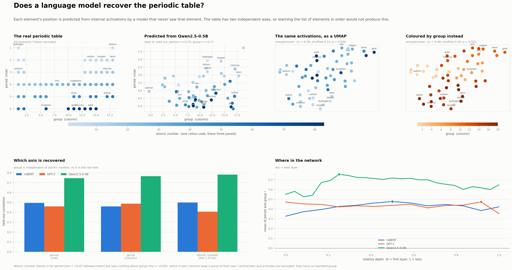

# Inside the representations of language models


What the **internal layers** of open-weight language models encode about living
things, meaning and places — and where in the network it lives.

Three models: **mBERT**, **GPT-2** and **Qwen2.5-0.5B**. Runs on **CPU**, uses
**open-weight models only**, and is **deterministic**: no sampling anywhere, and
every statistic is tested against a permutation null.

## Reproduce

```bash
pip install -e .
python tools/summary_figure.py
python tools/countries_figure.py
python tools/elements_figure.py
```

First run downloads four models (~2 GB, cached in `~/.cache/huggingface`) and
writes per-layer statistics to `results/`. Later runs reuse that cache.

## The idea

Put each item into fixed sentence frames, run the sentence through the model, and
read out the hidden state at **every layer**. Then ask one of two questions:

- do **distances** in the model track a real-world ground truth? (Mantel test)
- do **categories** form separate clusters? (silhouette)

Both always against a shuffled-label null, because the pairwise distances are not
independent of each other.

## What it shows

**Living things.** 87 organisms, five kingdoms. The further apart two organisms
are on the tree of life, the further apart the model puts them (ρ ≈ 0.36–0.39).
Whether fungi deviate from phylogeny — the obvious thing to look for, since they
are genetically closer to animals than plants are — turned out **not** to be
answerable here: the effect changes sign depending on which fungi are included,
which model, and which layer. Fungal names are also much rarer in text than
animal or plant names (mean log-probability −16.2 against −11.4 and −12.5), so
their representations are noisier.

**The periodic table.** 56 elements. Each one's position is predicted from
internal activations by a ridge model that never saw it, so the layout cannot come
from overfitting.



This is the only **two-dimensional** ground truth here — every other concept is a
scale, a circle or a tree — and the two axes are independent of each other
(ρ = 0.03), so learning the elements in order would not produce a grid. Qwen
recovers both axes well (period r = +0.75, group r = +0.77); mBERT and GPT-2 get
about +0.46 to +0.49. Group is the real test, since it is uncorrelated with atomic
number, and only Qwen picks it up in the distance geometry as well.

A predicted-coordinate plot is built to look like a table — its axes *are* the
predicted period and group — so the last two panels drop the supervision entirely:
a UMAP of the same activations, which is never told what to look for. Both
quantities still organise it (|r| with the better UMAP axis = 0.39 for atomic
number and 0.48 for group, against 0.14 under a label shuffle). The structure is
there before anyone asks for it; the regression recovers it more sharply
(0.75–0.77) because it may use all the dimensions rather than two.

Colour is **atomic number** across three of the four panels, since atomic number
tracks period almost perfectly (ρ = +0.97) and so makes period redundant. Group
keeps its own panel because atomic number says nothing about it at all
(ρ = +0.00) — that independence is the whole reason the periodic table is a
useful test here, rather than another 1-D scale.

**Meaning across languages.** 30 meanings × 6 languages. Early layers sort
sentences by **which language** they are in; by the middle layers that has
dissolved and they sort by **what they mean**, with all six languages mixed inside
each cluster.

**Countries.** Distance between 48 countries, compared against several external
ground truths at once.


The obvious worry is that any such result is really just *"the model has read more
about some countries than others"*. So two predictors measure exactly that: the
model's own log-probability of the country name, as a pair mean and as an absolute
difference. They do not explain the rest away — the **GDP gap stays significant in
all three models** with familiarity in the same regression, and geography does
too.

The depth traces show what a single layer would hide: **the economic signal is
strongest in the lower-middle layers and fades toward the output, while geography
grows with depth.**

## What held up, and what didn't

The coarse signals are robust. Fine-grained claims about particular sub-groups
were not — three of them dissolved once properly controlled, and they are worth
recording because each failed in a different way.

**A layer choice flipped a sign.** GPT-2's familiarity weight came out *negative*
under a rule that happened to select its layer 1 — where rare country names have
large vectors and sit on the rim of the space (ρ between familiarity and vector
norm is −0.44 there, −0.00 by layer 6). Token-frequency geometry, not geopolitics.
By layer 4 the sign flips and GPT-2 agrees with the other models.

**A stimulus set flipped a sign.** Fungi appeared to sit nearer plants than
phylogeny allows. Expanding the fungal set from 6 to 18 made the effect reverse in
mBERT (+0.43 → −0.22), vanish in Qwen (+0.31 → +0.04), and survive only in GPT-2.
It was a property of which six fungi were picked.

**A model choice flipped a result.** The same fungal comparison looked
non-monotonic under BERT at one layer and perfectly monotonic under mBERT at
another.

Hence the two rules now used throughout:

**The layer is chosen from different data.** The country layer is where the
*parallel corpus* clusters most by meaning and least by language — a criterion
that never touches the country data, so it cannot be tuned to the answer. Both
figures import it from one place (`curves.py`) so they cannot drift apart.

**Character offsets, not token counting.** The target word is located by its
character span. Comparing token counts of `prefix` and `prefix + word` is off by
one whenever the prefix ends in a space, and then every word silently returns the
vector of the following token.

## Layout

```
src/llmprobe/
  models.py       model registry, CPU-safe cached loading
  embed.py        per-layer activations for a word or a whole sentence
  geometry.py     distances, Mantel test, silhouette, 2-D projection
  familiarity.py  how well the model knows a name (the training-data control)
  curves.py       cached per-layer curves, and the one definition of the layer rule
  variables.py    the concepts and their ground truths
  stimuli/        taxonomy.yaml · countries.yaml · parallel.yaml · elements.yaml
tools/
  summary_figure.py     -> figures/SUMMARY.png
  countries_figure.py   -> figures/COUNTRIES.png
  elements_figure.py    -> figures/ELEMENTS.png
```

Stimuli are plain YAML — adding an organism, a country or a sentence is an edit,
not a code change.

## Limitations

Three models differing in many ways at once, so architectural explanations are
hypotheses, not demonstrated causes. Small stimulus sets (48–180 items), and only
48 independent units behind the 1,128 country pairs — which is why sub-group
comparisons keep failing to replicate while the overall correlations hold.

Taxonomic rank depth and language-family depth are coarse proxies for genetic and
cultural distance; GDP and population figures are approximate, rounded, around
2023. Fungal names are far rarer in text than animal or plant names (mean
log-probability −16.2 against −11.4 and −12.5), so that kingdom is measured more
noisily than the others.

Probes show that information is *available* in a representation, not that the
model *uses* it — that needs intervention, which this repo does not do.
