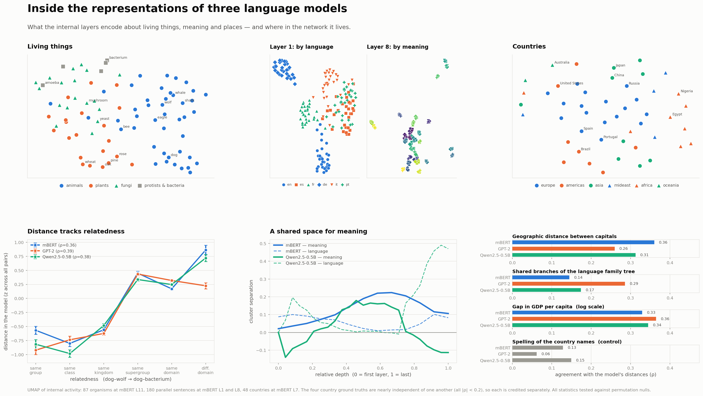
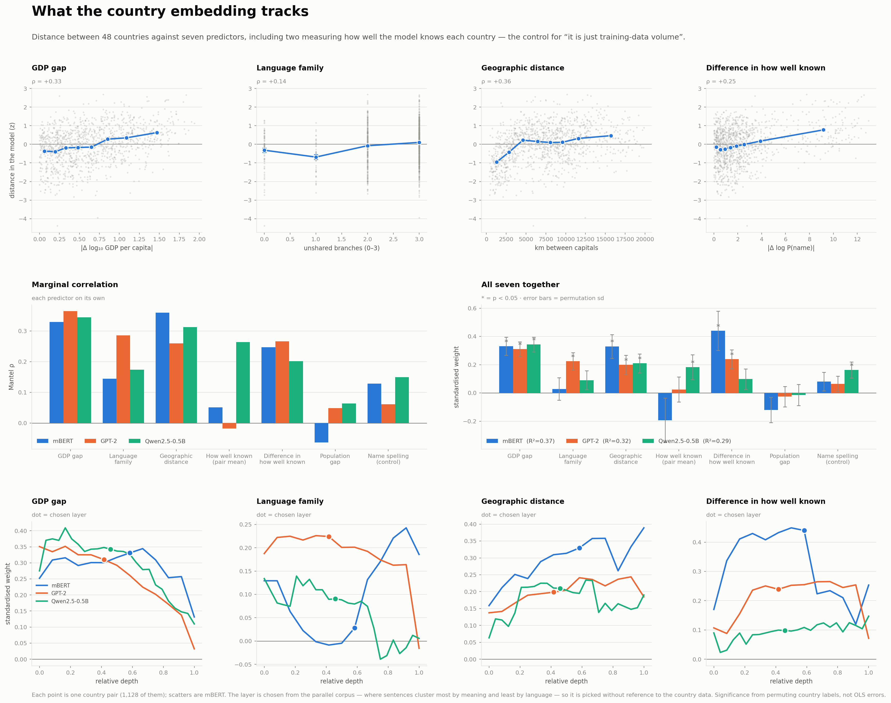

# Inside the representations of language models



What the **internal layers** of open-weight language models encode about living
things, meaning and places — and where in the network it lives.

Runs on **CPU**, uses **open-weight models only**, and is **deterministic**: no
sampling anywhere, and every statistic is tested against a permutation null.

## Reproduce

```bash
pip install -e .
python tools/summary_figure.py
python tools/countries_figure.py
```

First run downloads four models (~2 GB, cached in `~/.cache/huggingface`) and
writes per-layer statistics to `results/`. Later runs reuse that cache.

## The idea

Put each item into fixed sentence frames, run the sentence through the model, and
read out the hidden state at **every layer**. Then ask one of two questions:

- do **distances** in the model track a real-world ground truth? (Mantel test)
- do **categories** form separate clusters? (silhouette)

Both always against a shuffled-label null, because the pairwise distances are not
independent of each other.

## What it shows

**Living things.** 87 organisms, five kingdoms. The further apart two organisms
are on the tree of life, the further apart the model puts them (ρ ≈ 0.36–0.39).
Whether fungi deviate from phylogeny — the obvious thing to look for, since they
are genetically closer to animals than plants are — turned out **not** to be
answerable here: the effect changes sign depending on which fungi are included,
which model, and which layer. Fungal names are also much rarer in text than
animal or plant names (mean log-probability −16.2 against −11.4 and −12.5), so
their representations are noisier.

**Meaning across languages.** 30 meanings × 6 languages. Early layers sort
sentences by **which language** they are in; by the middle layers that has
dissolved and they sort by **what they mean**, with all six languages mixed inside
each cluster.

**Countries.** Distance between 48 countries, compared against several external
ground truths at once.



The obvious worry is that any such result is really just *"the model has read more
about some countries than others"*. So two predictors measure exactly that: the
model's own log-probability of the country name, as a pair mean and as an absolute
difference. They do not explain the rest away — the **GDP gap stays significant in
all three models** with familiarity in the same regression, and geography does
too.

The depth traces show what a single layer would hide: **the economic signal is
strongest in the lower-middle layers and fades toward the output, while geography
grows with depth.**

## Two details that decide whether any of this is real

**Character offsets, not token counting.** The target word is located by its
character span. Comparing token counts of `prefix` and `prefix + word` is off by
one whenever the prefix ends in a space, and then every word silently returns the
vector of the following token.

**The layer is chosen from different data.** For the country analysis the layer is
the one where the *parallel corpus* clusters most by meaning and least by
language — a criterion that never touches the country data, so it cannot be tuned
to the answer. An earlier rule picked GPT-2's layer 1, where rare country names
have large vectors and sit on the rim of the space (ρ between familiarity and
vector norm is −0.44 there, −0.00 by layer 6). That is token-frequency geometry,
not geopolitics, and it had flipped the sign of a weight.

## Layout

```
src/llmprobe/
  models.py       model registry, CPU-safe cached loading
  embed.py        per-layer activations for a word or a whole sentence
  geometry.py     distances, Mantel test, silhouette, 2-D projection
  familiarity.py  how well the model knows a name (the training-data control)
  variables.py    the concepts and their ground truths
  stimuli/        taxonomy.yaml · countries.yaml · parallel.yaml
tools/
  summary_figure.py     -> figures/SUMMARY.png
  countries_figure.py   -> figures/COUNTRIES.png
```

Stimuli are plain YAML — adding an organism, a country or a sentence is an edit,
not a code change.

## Limitations

Four models differing in many ways at once, so architectural explanations are
hypotheses, not demonstrated causes. Small stimulus sets (48–180 items), and only
48 independent units behind the 1,128 country pairs. Taxonomic rank depth and
language-family depth are coarse proxies for genetic and cultural distance; GDP
and population figures are approximate, rounded, around 2023. Probes show that
information is *available* in a representation, not that the model *uses* it —
that needs intervention, which this repo does not do.
