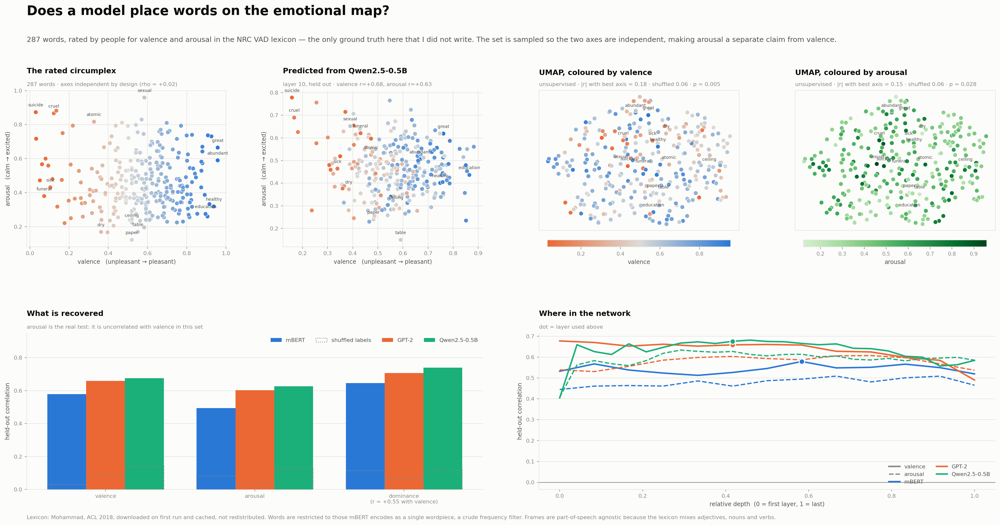

# Inside the representations of language models


What the **internal layers** of open-weight language models encode about living
things, meaning and places — and where in the network it lives.

Three models: **mBERT**, **GPT-2** and **Qwen2.5-0.5B**. Runs on **CPU**, uses
**open-weight models only**, and is **deterministic**: no sampling anywhere, and
every statistic is tested against a permutation null.

## Reproduce

```bash
pip install -e .
python tools/summary_figure.py
python tools/countries_figure.py
python tools/elements_figure.py
python tools/numbers_figure.py
python tools/emotions_figure.py
```

First run downloads four models (~2 GB, cached in `~/.cache/huggingface`) and,
for the emotions figure, the NRC VAD lexicon (into `results/cache/`). Per-layer
statistics are written to `results/`; later runs reuse all of it.

## The idea

Put each item into fixed sentence frames, run the sentence through the model, and
read out the hidden state at **every layer**. Then ask one of two questions:

- do **distances** in the model track a real-world ground truth? (Mantel test)
- do **categories** form separate clusters? (silhouette)

Both always against a shuffled-label null, because the pairwise distances are not
independent of each other.

## What it shows

**Living things.** 87 organisms, five kingdoms. The further apart two organisms
are on the tree of life, the further apart the model puts them (ρ ≈ 0.36–0.39).
Whether fungi deviate from phylogeny — the obvious thing to look for, since they
are genetically closer to animals than plants are — turned out **not** to be
answerable here: the effect changes sign depending on which fungi are included,
which model, and which layer. Fungal names are also much rarer in text than
animal or plant names (mean log-probability −16.2 against −11.4 and −12.5), so
their representations are noisier.

**Emotion words.** 287 words scored against the NRC VAD lexicon (Mohammad, ACL
2018) — the only ground truth here that I did not write myself. The lexicon is
downloaded on first run and cached, not redistributed.



The affective circumplex is two-dimensional like the periodic table, and gets the
same treatment: across the full lexicon valence and arousal correlate at −0.27,
so the stimulus set is drawn evenly from a grid of valence × arousal cells, which
brings that to **+0.02 within the set**. Only then is "arousal is encoded" a
separate claim from "valence is encoded".

Both are recovered from held-out words — valence r = +0.58 to +0.68, arousal
r = +0.49 to +0.63, against shuffled-label nulls of 0.03–0.14. Dominance scores
highest of the three (+0.65 to +0.74) but is **not** an independent axis: it still
correlates +0.55 with valence after the grid sampling, so that number is largely a
valence score under another name.

The dissociation between probe and geometry is starker here than anywhere else in
the repo: valence is decodable at +0.68, yet organises the unsupervised UMAP at
only |r| = 0.18. The information is linearly available without being what the
representation is mostly *about*.

**Meaning across languages.** 30 meanings × 6 languages. Early layers sort
sentences by **which language** they are in; by the middle layers that has
dissolved and they sort by **what they mean**, with all six languages mixed inside
each cluster.

**Countries.** Distance between 48 countries, compared against several external
ground truths at once.


The obvious worry is that any such result is really just *"the model has read more
about some countries than others"*. So two predictors measure exactly that: the
model's own log-probability of the country name, as a pair mean and as an absolute
difference. They do not explain the rest away — the **GDP gap stays significant in
all three models** with familiarity in the same regression, and geography does
too.

The depth traces show what a single layer would hide: **the economic signal is
strongest in the lower-middle layers and fades toward the output, while geography
grows with depth.**

**Further explorations.** Several more concepts are in the repo without a
write-up here — run their scripts to see what they give:

- **the periodic table** (`tools/elements_figure.py`), 56 elements on a genuinely
  two-dimensional ground truth
- **numbers** (`tools/numbers_figure.py`), 1–400, where the controls are
  arithmetic rather than statistical
- **body parts** (`tools/bodyparts_figure.py`), 90 parts on a head-to-toe
  coordinate with an internal/external control independent of height

## Layout

```
src/llmprobe/
  models.py       model registry, CPU-safe cached loading
  embed.py        per-layer activations for a word or a whole sentence
  geometry.py     distances, Mantel test, silhouette, 2-D projection
  familiarity.py  how well the model knows a name (the training-data control)
  curves.py       cached per-layer curves, and the one definition of the layer rule
  variables.py    the concepts and their ground truths
  stimuli/        taxonomy.yaml · countries.yaml · parallel.yaml · elements.yaml · numbers.yaml · emotions.yaml · bodyparts.yaml
tools/
  summary_figure.py     -> figures/SUMMARY.png
  countries_figure.py   -> figures/COUNTRIES.png
  elements_figure.py    -> figures/ELEMENTS.png
  numbers_figure.py     -> figures/NUMBERS.png
  emotions_figure.py    -> figures/EMOTIONS.png
  bodyparts_figure.py   -> figures/BODYPARTS.png
```

Stimuli are plain YAML — adding an organism, a country or a sentence is an edit,
not a code change.

## Limitations

Three models differing in many ways at once, so architectural explanations are
hypotheses, not demonstrated causes. Small stimulus sets (48–180 items), and only
48 independent units behind the 1,128 country pairs — which is why sub-group
comparisons keep failing to replicate while the overall correlations hold.

Taxonomic rank depth and language-family depth are coarse proxies for genetic and
cultural distance; GDP and population figures are approximate, rounded, around
2023. Fungal names are far rarer in text than animal or plant names (mean
log-probability −16.2 against −11.4 and −12.5), so that kingdom is measured more
noisily than the others.

Probes show that information is *available* in a representation, not that the
model *uses* it — that needs intervention, which this repo does not do.
